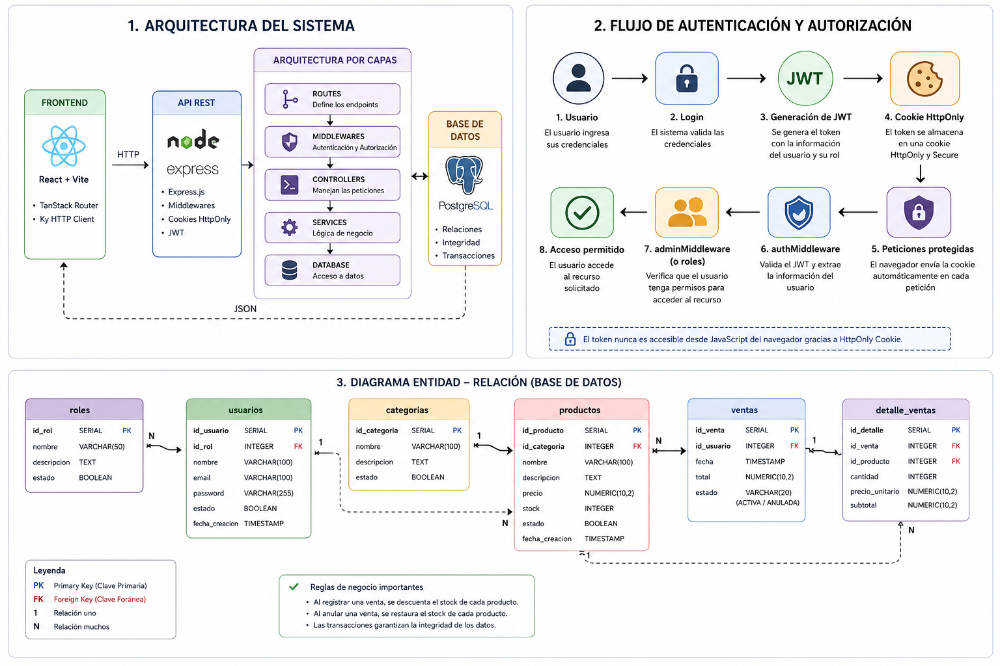
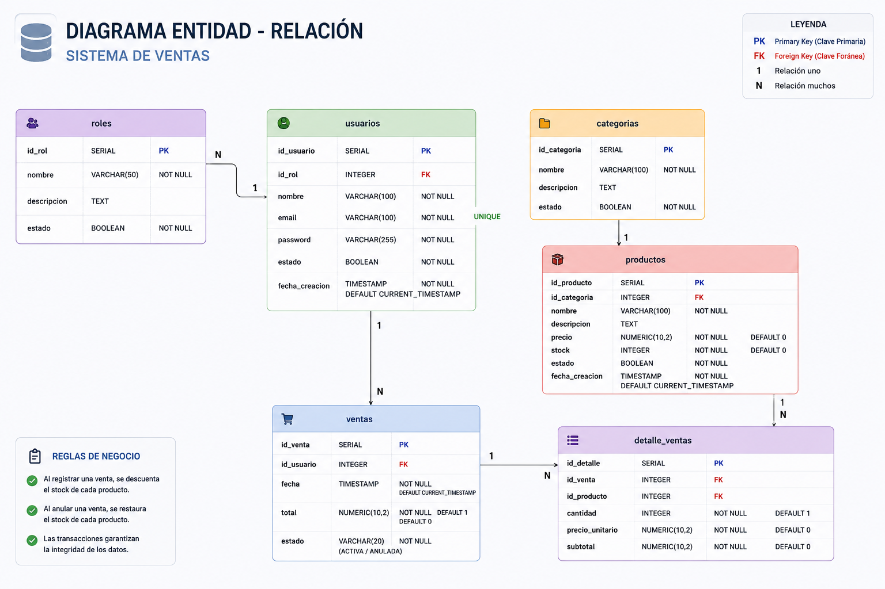
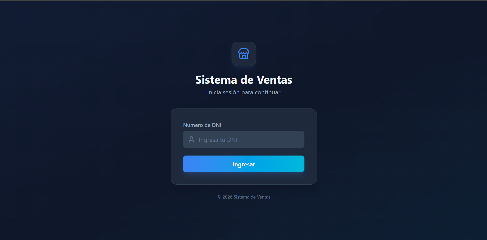
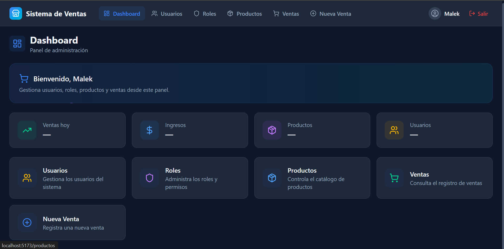
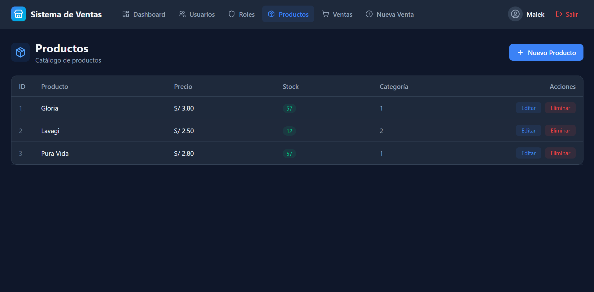
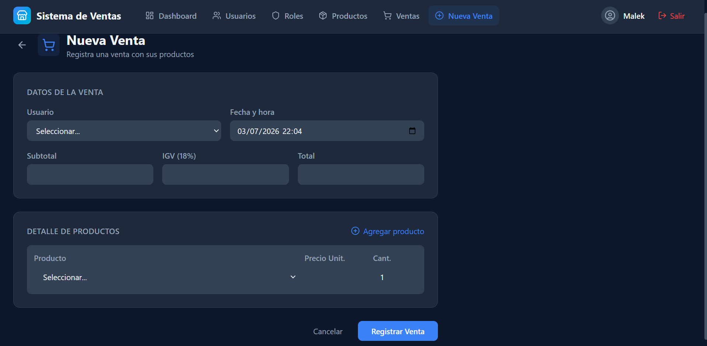
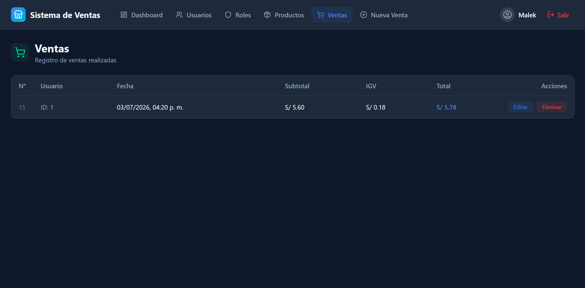

# 🛒 Sistema de Ventas - API REST

<p align="center">

API REST desarrollada con **Node.js**, **Express** y **PostgreSQL** para la gestión de un sistema de ventas.

Implementa autenticación mediante **JWT**, almacenamiento seguro con **Cookies HttpOnly**, autorización por **Roles**, arquitectura por capas y transacciones para garantizar la integridad de los datos.

</p>



---

# 📖 Descripción

Este proyecto fue desarrollado con el objetivo de construir un sistema de ventas completo aplicando buenas prácticas de desarrollo Backend.

El sistema permite administrar usuarios, productos, categorías, ventas e inventario, asegurando la integridad de la información mediante transacciones y control de acceso por roles.

---

## ✨ Características

- Autenticación con JWT
- Cookies HttpOnly
- Autorización por Roles
- CRUD de Usuarios
- CRUD de Roles
- CRUD de Productos
- Registro de Ventas
- Registro de Detalle de Ventas
- Descuento automático de Stock
- Restauración de Stock al anular una venta
- Manejo global de errores
- Arquitectura por Capas
- Validación de datos
- Transacciones en PostgreSQL

---

## 🚀 Tecnologías utilizadas

### Backend

- Node.js
- Express
- PostgreSQL
- JWT
- Cookie Parser
- Morgan
- CORS

### Frontend

- React
- Vite
- TanStack Router
- Ky

---

## 🏗️ Arquitectura

El proyecto sigue una **arquitectura por capas**, separando cada responsabilidad para mantener un código limpio, escalable y fácil de mantener.

```
                    React + Vite
                         │
                         ▼
                  Ky HTTP Client
                         │
                         ▼
                  Express API REST
                         │
        ┌────────────────┴────────────────┐
        ▼                                 ▼
 Validadores                     Middlewares
                                        │
                                        ▼
                                 Autenticación
                                 Autorización
                                        │
                                        ▼
                                  Controllers
                                        │
                                        ▼
                                    Services
                                        │
                                        ▼
                                  PostgreSQL
```

### Flujo de una petición

Cliente (React)

↓

Ky envía la petición HTTP

↓

Express recibe la petición

↓

Validación de datos

↓

Middleware de autenticación (JWT)

↓

Middleware de autorización (Roles)

↓

Controller

↓

Service

↓

Base de datos PostgreSQL

↓

Respuesta al cliente
---
## 🔐 Autenticación y autorización

La autenticación se implementa utilizando **JWT (JSON Web Token)** almacenado en una **cookie HttpOnly**, evitando que el token pueda ser accedido desde JavaScript del navegador.

### Flujo de autenticación
```
Usuario

↓

Login

↓

Verificación de credenciales

↓

Generación del JWT

↓

Cookie HttpOnly

↓

Peticiones protegidas

↓

authMiddleware

↓

adminMiddleware

↓

Acceso al recurso solicitado
```
---
### Roles implementados

- 👤 Trabajador
  - Registrar ventas
  - Consultar información permitida

- 👨‍💼 Administrador
  - Gestión de usuarios
  - Gestión de productos
  - Gestión de roles
  - Gestión de ventas
---
## 🗄️ Modelo de Base de Datos

La base de datos fue diseñada siguiendo un modelo relacional para garantizar la integridad de la información y evitar redundancia de datos.

### Entidades principales

- **Roles**
  - Define los permisos disponibles dentro del sistema.

- **Usuarios**
  - Representa a los trabajadores y administradores del sistema.

- **Categorías**
  - Permite clasificar los productos.

- **Productos**
  - Almacena la información del inventario.

- **Ventas**
  - Representa la cabecera de cada venta realizada.

- **Detalle de Ventas**
  - Contiene los productos vendidos en cada venta.

### Relaciones

Roles
│
└── Usuarios

Categorías
│
└── Productos

Usuarios
│
└── Ventas
      │
      └── Detalle_Ventas
              │
              └── Productos
---

## 📊 Diagrama Entidad-Relación



---

## 📂 Estructura del Proyecto

```text
src
│
├── controllers
│
├── services
│
├── routes
│
├── middlewares
│
├── validators
│
├── database
│
├── utils
│
├── app.js
│
└── server.js
```

### Descripción

- **controllers/** → Gestionan las peticiones HTTP.
- **services/** → Contienen la lógica de negocio.
- **routes/** → Definen los endpoints de la API.
- **middlewares/** → Autenticación, autorización y manejo de errores.
- **validators/** → Validación de datos de entrada.
- **database/** → Configuración de PostgreSQL y consultas.
- **utils/** → Funciones auxiliares reutilizables.

---

### 4. Configurar variables de entorno

Crear un archivo `.env`

```env
PORT=

HOST=

USER=

PASSWORD=

DATABASE=

JWT_SECRET=
```

### 5. Ejecutar el proyecto

```bash
pnpm dev
```

---

## 📌 Endpoints principales

### Autenticación

| Método | Endpoint | Descripción |
|--------|----------|-------------|
| POST | /usuarios/login | Iniciar sesión |
| POST | /usuarios/logout | Cerrar sesión |

### Usuarios

| Método | Endpoint |
|--------|----------|
| GET | /usuarios |
| POST | /usuarios |
| PUT | /usuarios/:id |
| DELETE | /usuarios/:id |

### Productos

| Método | Endpoint |
|--------|----------|
| GET | /productos |
| POST | /productos |
| PUT | /productos/:id |
| DELETE | /productos/:id |

### Ventas

| Método | Endpoint |
|--------|----------|
| POST | /ventas |
| PATCH | /ventas/:id/anular |

---
## 📸 Capturas del Proyecto

A continuación se muestran algunas capturas del funcionamiento de la aplicación.

### 🔑 Inicio de sesión



---

### 📊 Dashboard



---

### 📦 Gestión de Productos



---

### 💰 Registro de Ventas



---

### 📋 Historial de Ventas



---

## 📈 Características Técnicas

- Arquitectura por capas.
- API REST.
- Autenticación mediante JWT.
- Cookies HttpOnly.
- Autorización basada en Roles.
- PostgreSQL como gestor de base de datos.
- Transacciones para garantizar la integridad de los datos.
- Validación de datos antes de cada operación.
- Manejo global de errores.
- Separación entre lógica de negocio y acceso a datos.

---

## 👨‍💻 Autor

**Jabes Cruz de Valera**

Backend Developer en formación.
---

## ⭐ Estado del proyecto

✅ Proyecto finalizado

Actualmente el sistema implementa:

- Gestión de Usuarios
- Gestión de Roles
- Gestión de Productos
- Registro de Ventas
- Anulación de Ventas
- Control automático de Stock
- Restauración de Stock mediante transacciones
- Autenticación JWT
- Autorización por Roles
